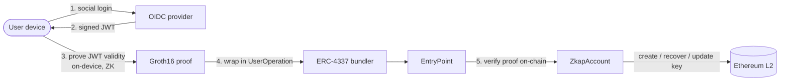
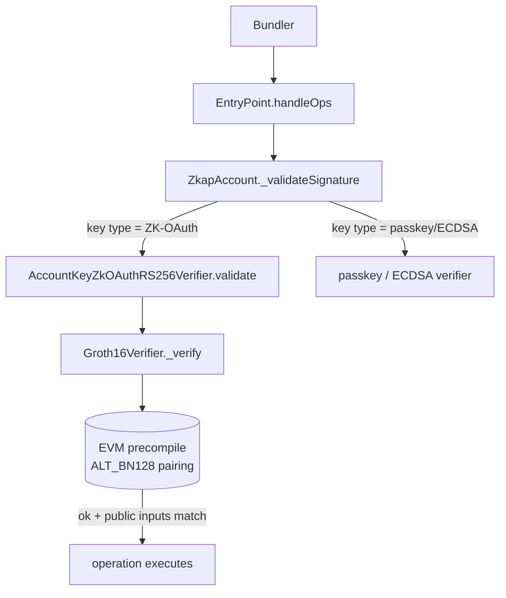

# ZKAP Architecture

*Read this in [한국어](../ko/ARCHITECTURE.md).*

> How ZKAP works, at the concept level: the end-to-end flow, the layered stack,
> what the circuit proves, and how a proof is verified on-chain. Code-level detail
> lives in each repo (see [REPOS.md](./REPOS.md)); terms are defined in
> [GLOSSARY.md](./GLOSSARY.md); the trust boundary is summarized in
> [TRUST-MODEL.md](./TRUST-MODEL.md).

> ⚠️ **Status:** experimental / testnet. Not audited for production custody of
> real funds.

---

## 1. The idea in one diagram

ZKAP proves a social-login token is valid in zero knowledge and uses that proof
as the root authority of an Ethereum smart account.



The token is verified, not stored or revealed: the JWT stays on the device, the
proof goes on-chain, and the contract checks the proof — never the token.

---

## 2. Layered architecture

ZKAP is four layers. Each is a separate repo that can be reused on its own.

```
   ┌─────────────────────────────────────────────────────────────┐
   │  APP        zkap-reference-app   (React Native wallet)        │
   │             zkap-zkp-quickstart  (end-to-end tutorial)        │
   ├─────────────────────────────────────────────────────────────┤
   │  SDK        zkap-aa-sdk          zkap-zkp-sdk                 │
   │             (build/sign UserOps) (on-device proving)          │
   ├─────────────────────────────────────────────────────────────┤
   │  ON-CHAIN   zkap-contracts       (ERC-4337 + on-chain verifier)│
   ├─────────────────────────────────────────────────────────────┤
   │  CRYPTO     zkap-circuit         (the ZK statement + setup)    │
   └─────────────────────────────────────────────────────────────┘
```

**Two couplings carry the protocol across layers:**

1. **Build-time: `zkap-circuit` → `zkap-contracts`.** The circuit generates the
   on-chain `Groth16Verifier.sol`. The verifying contract and the keys that make
   proofs must come from the **same trusted setup**; mixing builds makes every
   proof fail.
2. **Run-time: `zkap-circuit` → `zkap-zkp-sdk`.** The SDK loads the circuit's CRS
   bundle to generate proofs on the user's device.

Everything else is ordinary code dependency: the app calls the two SDKs, the AA
SDK targets the contracts, the quickstart wires it all together. See
[REPOS.md](./REPOS.md) for the dependency graph.

---

## 3. The proof data flow

What happens when a user does something that needs the master key (create,
recover, or update a key):

```mermaid
flowchart TD
    A[Build the UserOperation<br/>e.g. updateTxKey] --> B[Compute userOpHash]
    B --> C[random = 31 fresh bytes]
    C --> D[zkNonce = Poseidon&#40;userOpHash, random&#41;]
    D --> E[Social login with nonce = zkNonce]
    E --> F[Provider returns signed JWT<br/>whose nonce claim = zkNonce]
    F --> G[Read the account's anchor + issuer Merkle data]
    G --> H[prove&#40;&#41; on-device → Groth16 proof + public inputs]
    H --> I[Encode proof as the ZK-OAuth signature on the UserOp]
    I --> J[Bundler → EntryPoint → ZkapAccount verifies on-chain]
```



The key move is step D–F: the JWT's `nonce` is bound to *this* UserOperation
(`zkNonce = Poseidon(userOpHash, random)`), so a proof is valid for exactly one
operation and cannot be replayed. Everyday transactions skip this entirely — they
are signed with the TX key (a passkey) and need no proof.

---

## 4. What the circuit proves

In one sentence: *"I hold a valid OIDC JWT, signed (RS256 / RSA-2048) by a key in
the on-chain trusted-issuer Merkle tree, for an allowed audience, and this proof
is bound to a specific operation — without revealing the token or any claim."*

More precisely, the statement checks:

- **JWT signature.** The JWT is signed with **RS256** (standard RSA-2048 +
  SHA-256); the circuit verifies that signature against the provider's RSA public
  key.
- **Issuer membership.** That RSA key is a leaf in the on-chain Poseidon Merkle
  tree of trusted issuers — proven by a Merkle path against the published root.
- **Audience allowlist.** The token's `aud` is in the account's allowed set
  (committed as `hAudList`).
- **Threshold anchor membership.** The identity is part of the registered k-of-n
  threshold anchor (see §6).
- **Operation binding.** The proof is bound to a specific `userOpHash` and a
  non-zero random blind, so it is single-use.

### Public inputs (concept level)

Each proof carries an 8-element public-input vector — the values the on-chain
verifier checks the proof against. Conceptually:

| Public input | Meaning |
|--------------|---------|
| `hanchor` | commitment to the registered threshold anchor |
| `h_a` | context/anchor hash |
| `root` | Merkle root of trusted issuer keys |
| `h_sign_user_op` | binds the proof to this UserOperation |
| `jwt_exp` | JWT expiry (per proof) |
| `verification_rhs` | this proof's partial value for the threshold check (per proof) |
| `lhs` | the threshold batch total the partials must sum to |
| `h_aud_list` | audience commitment; must match the account's `hAudList` |

> The exact field order, serialization, and naming are owned by
> [`zkap-circuit`](https://github.com/snp-labs/zkap-circuit) — this table is the
> concept, not the wire format.

---

## 5. The dual-key model

Every ZKAP wallet separates two jobs across two kinds of key, so the rare
high-value authority and the frequent low-friction authority never share a
credential.

```
┌──────────────────── ZkapAccount (ERC-4337 smart account) ────────────────────┐
│                                                                               │
│   Master Key  (ZK-OAuth)              TX Key  (passkey / ECDSA)                │
│   ─────────────────────               ─────────────────────────               │
│   • account ownership                 • everyday transactions                 │
│   • recovery                          • ETH / token transfers                 │
│   • key updates                       • contract calls                        │
│                                                                               │
│   authorized by a ZK proof of         authorized by a device-held passkey     │
│   social login (rare, high-value)     signature (frequent, low-friction)      │
└───────────────────────────────────────────────────────────────────────────────┘
```

- **Master key (ZK-OAuth).** Spending it requires a fresh ZK proof of social
  login. This is where the circuit sits in the security model.
- **TX key.** A device-held passkey signs everyday transactions; no proof needed.

The contracts support pluggable key verifiers, so a single account can register
several key types with per-purpose weights and thresholds:

| Key type | Verifier contract | Use |
|----------|-------------------|-----|
| ZK-OAuth (RS256) | `AccountKeyZkOAuthRS256Verifier` | master key — ownership / recovery |
| Passkey (P-256) | `AccountKeySecp256r1` / `AccountKeyWebAuthn` | everyday signing |
| ECDSA | `AccountKeyAddress` | EOA-style signing / testing |

Losing the device is recoverable: register a new passkey by spending the master
key (a ZK proof of social login). No seed phrase, ever.

---

## 6. Threshold anchor, issuer directory, and audience

Three on-chain commitments define an account's identity policy.

- **Threshold anchor (k-of-n).** Recovery is bound to a set of *n* independent
  OIDC identities, of which any *k* valid proofs authorize an operation, via a
  Vandermonde / Shamir-style polynomial scheme. The circuit emits **k proofs that
  must all pass**, and the on-chain verifier additionally checks that their
  partial values **sum into one batch** (`Σ verification_rhs == lhs`) — which is
  what binds k separate proofs into a single threshold decision. No single issuer
  is required to recover — but distribution holds only if the n identities are
  genuinely independent providers (three accounts from one provider give the
  convenience of threshold recovery, not its distribution).
- **Issuer Merkle directory.** An on-chain Poseidon Merkle tree
  (`PoseidonMerkleTreeDirectory`) holds the trusted providers' RSA public keys.
  The circuit proves the JWT's signing key is a member. When a provider rotates
  its key, the tree is updated (under timelock governance). Note the height
  mapping: the SDK/circuit Merkle path length is `tree_height` (15) and the
  on-chain tree depth is `tree_height + 1` (16).
- **Audience commitment (`hAudList`).** The allowed `aud` (OAuth client ID) is
  Poseidon-hashed into the account; a proof's `h_aud_list` must equal it.

---

## 7. Trusted setup and the CRS bundle

Groth16 needs a one-time, per-circuit trusted setup. Its output is a **CRS
bundle** — a directory the SDK proves against:

```
circuit.ar1cs  pk.bin  vk.bin  pvk.bin  Groth16Verifier.sol  config.json
manifest.json  [witness_gen.wasm]
```

- `pk.bin` generates proofs; `vk.bin` / `pvk.bin` verify them;
  `Groth16Verifier.sol` is the on-chain verifier; `config.json` is the circuit
  shape.
- **`manifest.json` is the single trust gate.** It carries per-file hashes and an
  optional signature. The loader checks the manifest *once*; after that `prove()`
  trusts the bundle and re-verifies nothing. This keeps the prove hot path simple
  and moves all integrity checking to one auditable place.
- `witness_gen.wasm` ships independently and is verified against the bundle via a
  separate `witness_gen.json` sidecar (keyed on the circuit's `ar1cs_blake3`)
  before proving (fail-closed).

Because soundness depends on the setup secret being destroyed, the public-good
plan is a multi-party ceremony with published transcripts.

---

## 8. On-chain verification path

When a UserOperation arrives, the account routes signature validation to the
right key verifier; the ZK-OAuth path runs the Groth16 pairing check.



Concrete numbers (concept level): a Groth16 proof is a fixed ~256 bytes (8 ×
uint256), and on-chain verification costs on the order of hundreds of thousands
of gas, dominated by the BN254 pairing precompile. The verifier also checks the
public inputs (audience, root, operation binding, threshold batch) match the
account's registered policy.

Key contracts are deployed once and shared by all wallets (singleton pattern);
each wallet stores its own key data. Library linking ties the ZK-OAuth verifier
to `Groth16Verifier` and `PoseidonHashLib`. Exact wiring lives in
[`zkap-contracts`](https://github.com/baerae-zkap/zkap-contracts).

---

## 9. Deployment & addresses

- **Deterministic addresses.** `ZkapAccountFactory` deploys wallets with CREATE2,
  so a wallet has a **counterfactual address** — known and fundable before it is
  deployed. The first UserOp deploys it on-chain via `initCode`.
- **Same address across chains.** Contracts are deployed on **Base Sepolia**
  (`84532`) and **Arbitrum Sepolia** (`421614`) at **identical CREATE2
  addresses** (verified on-chain). Key contract addresses are listed in the
  [README](./README.md).

---

## 10. Cross-cutting properties

- **Replay protection.** `zkNonce = Poseidon(userOpHash, random)` binds each
  proof to one UserOperation. A proof cannot be reused for a different operation.
- **Privacy.** The proof reveals only that a valid JWT exists for the expected
  issuer/audience. The token, the user's email, name, and other claims are never
  put on-chain. What *is* observable: the audience commitment, proof timing, and
  the account's on-chain activity.
- **On-device proving.** Proofs are generated where the token already is — the
  user's device — so the login token is never sent to a backend.

---

## Where to go deeper

| For | Go to |
|-----|-------|
| The circuit, statement, and trusted setup | [zkap-circuit](https://github.com/snp-labs/zkap-circuit) |
| Contracts and on-chain verification | [zkap-contracts](https://github.com/baerae-zkap/zkap-contracts) |
| On-device proving / building UserOps | [zkap-zkp-sdk](https://github.com/baerae-zkap/zkap-zkp-sdk) · [zkap-aa-sdk](https://github.com/baerae-zkap/zkap-aa-sdk) |
| The trust boundary | [TRUST-MODEL.md](./TRUST-MODEL.md) |
| Terms | [GLOSSARY.md](./GLOSSARY.md) |
