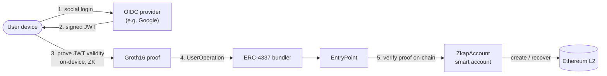

# ZKAP

*Read this in [한국어](../ko/README.md).*

**Prove your social login in zero knowledge. Own your account on Ethereum.**

ZKAP lets a user prove — in zero knowledge — that their social-login token (an
OIDC ID token / JWT from a provider such as Google) is valid, *without
revealing the token*. That proof becomes the root authority of an
[ERC-4337](https://eips.ethereum.org/EIPS/eip-4337) smart account: users create
and recover wallets with familiar social login and **no seed phrase**, and sign
everyday transactions with a passkey.

ZKAP is **open-source public-good infrastructure** — circuits, contracts, and
SDKs that any wallet can reuse without re-implementing the cryptography.

> ⚠️ **Status:** experimental / testnet. Not audited for production custody of
> real funds. See [Security](#security).

---

## Why this matters

Today's social-login wallets are convenient, but account creation and recovery
usually depend on a specific provider or backend — so a user's access can still
hinge on a centralized server's availability and policies. ZKAP moves that
verification **on-chain**: account creation and recovery are carried out
verifiably through smart-account policy and zero-knowledge proofs, not a backend.

- **No seed phrase.** Onboard and recover with social login you already use.
- **No single point of trust.** Recovery is bound to a *threshold* of
  independent OIDC providers — a k-of-n "threshold anchor". No single provider
  is indispensable.
- **The token never leaves the device.** Proving runs on the user's own device,
  so the login token is never sent to a wallet backend.

Sui's zkLogin and Aptos's Keyless already verify OIDC login on-chain in
production. On Ethereum, similar approaches remain largely at the
standardization / early stage, with few adopted production wallets. **ZKAP aims
to bring this to Ethereum as practical, reusable infrastructure** — and maps
directly to the Ethereum Foundation's
[Trustless Manifesto](https://protocol.ethereum.foundation/): no critical
secrets, no indispensable intermediaries, no unverifiable outcomes.

---

## Start here

| You are… | Go to |
|----------|-------|
| 🔬 **Evaluating the project** (grant reviewer, researcher) | [ARCHITECTURE.md](./ARCHITECTURE.md) → [TRUST-MODEL.md](./TRUST-MODEL.md) |
| 🛠️ **Want to run it end-to-end** | [zkap-zkp-quickstart](https://github.com/baerae-zkap/zkap-zkp-quickstart) |
| 🔌 **Integrating into your app** | [zkap-zkp-sdk](https://github.com/baerae-zkap/zkap-zkp-sdk) + [zkap-aa-sdk](https://github.com/baerae-zkap/zkap-aa-sdk) |
| 📱 **Want the full wallet flow** | [zkap-reference-app](https://github.com/baerae-zkap/zkap-reference-app) |
| 🧠 **New to the terms** (anchor, hAudList, UserOp…) | [GLOSSARY.md](./GLOSSARY.md) |

---

## How it works (at a glance)

1. The user authenticates with an OIDC provider and receives a signed JWT.
2. The device generates a **Groth16 proof** that the JWT is valid for an
   expected `aud`/`iss`, **without revealing the token** — using
   [`zkap-circuit`](https://github.com/snp-labs/zkap-circuit) via the
   [`zkap-zkp-sdk`](https://github.com/baerae-zkap/zkap-zkp-sdk).
3. The proof is wrapped in a [ERC-4337 `UserOperation`](https://eips.ethereum.org/EIPS/eip-4337)
   by the [`zkap-aa-sdk`](https://github.com/baerae-zkap/zkap-aa-sdk).
4. On-chain, [`zkap-contracts`](https://github.com/baerae-zkap/zkap-contracts)
   verify the proof and authorize account creation, recovery, or a key update.

Full details, including the multi-issuer **threshold anchor** and the
passkey/ZK key split, are in [ARCHITECTURE.md](./ARCHITECTURE.md).

---

## The repositories

ZKAP is split across focused repositories. This repo is the **map**; each one
below links back here.

| Repo | Role | Stack | Package |
|------|------|-------|---------|
| [**zkap-circuit**](https://github.com/snp-labs/zkap-circuit) | The zk-OAuth proving circuit (statement, trusted setup, proving/verifying) | Rust · Groth16 · BN254 | — |
| [**zkap-zkp-sdk**](https://github.com/baerae-zkap/zkap-zkp-sdk) | On-device proving SDK across runtimes | Rust → Node / WASM / React Native | [`@baerae/zkap-zkp`](https://www.npmjs.com/package/@baerae/zkap-zkp) |
| [**zkap-contracts**](https://github.com/baerae-zkap/zkap-contracts) | ERC-4337 smart account, factory, paymaster, on-chain verifier | Solidity | — |
| [**zkap-aa-sdk**](https://github.com/baerae-zkap/zkap-aa-sdk) | Account-abstraction SDK: UserOp building & signing | TypeScript | [`@baerae/zkap-aa`](https://www.npmjs.com/package/@baerae/zkap-aa) |
| [**zkap-reference-app**](https://github.com/baerae-zkap/zkap-reference-app) | Reference wallet demonstrating the full flow | React Native (Expo) | — |
| [**zkap-zkp-quickstart**](https://github.com/baerae-zkap/zkap-zkp-quickstart) | End-to-end tutorial: circuit → contracts → proof → on-chain | TypeScript / docs | — |

See [REPOS.md](./REPOS.md) for the dependency graph and a deeper description of
each layer.

---

## Live on testnet

ZKAP is deployed and demonstrated on **Base Sepolia** (chainId `84532`) and
**Arbitrum Sepolia** (chainId `421614`) with identical CREATE2 addresses
(verified on-chain).

Key contracts (Base Sepolia):

| Contract | Address |
|----------|---------|
| EntryPoint (ERC-4337) | `0x4337084D9E255Ff0702461CF8895CE9E3b5Ff108` |
| ZkapAccountFactory | `0xC4963E40E40FD9AfD16BDF81f51E3D00d36aE8c9` |
| Groth16 Verifier (1-of-1) | `0x249E20ad72aEd5D663940d527155AeF1E8014FD1` |
| Groth16 Verifier (3-of-3) | `0x8213F5d4176185b6f44CCbE9C1e58B512Dc0a50E` |
| PoseidonMerkleTreeDirectory | `0x93167F5048100Cc592BCB1F686d35eDD24b63581` |

The reference app demonstrates the complete lifecycle end-to-end: social-login
wallet creation → everyday transactions → account recovery via independent
social logins after a device key is lost.

---

## Trust model (short version)

ZKAP still relies on: the **availability and key correctness of OIDC providers**
(e.g. Google) and **ERC-4337 infrastructure** (bundlers). It does *not* rely
on a ZKAP backend for custody or recovery — the signing key lives on the user's
device (passkey), recovery is bound to a k-of-n threshold of independent
providers so **no single provider is a point of trust**, and only identity
verification is performed on-chain in zero knowledge. See
[TRUST-MODEL.md](./TRUST-MODEL.md).

---

## Status

ZKAP is experimental and runs on public testnets today. The protocol — circuit,
contracts, and SDKs — ships publicly as a public good, free for anyone to build
on.

## License

Dual-licensed under MIT and Apache-2.0, at
your option. Individual repositories follow the same dual license; generated
on-chain verifier files in `zkap-contracts` retain their upstream GPL/LGPL
headers (see that repo's `LICENSE`).

## Security

Please report vulnerabilities privately to **jaewoong@baerae.com** — do not open
public issues for security reports.

## Acknowledgements

ZKAP's zero-knowledge circuits are co-developed with **SNP Lab at Hanyang
University**. Their research in zk-SNARK proof systems is published at top
venues — IEEE TDSC, Financial Cryptography, ACM AsiaCCS, and ACM CCS —
so the zk-OAuth circuit is grounded in peer-reviewed research.

Selected publications:

1. S. Lee, H. Ko, J. Kim, and H. Oh. "vCNN: Verifiable Convolutional Neural Network Based on zk-SNARKs." *IEEE Transactions on Dependable and Secure Computing*, vol. 21, no. 4, pp. 4254–4270, 2024. DOI: [10.1109/TDSC.2023.3348760](https://doi.org/10.1109/TDSC.2023.3348760) (IEEE TDSC Best Paper Award).
2. J. Lee, J. Choi, J. Kim, and H. Oh. "SAVER: SNARK-Compatible Verifiable Encryption." *Financial Cryptography and Data Security (FC '24)*, LNCS vol. 14745, pp. 209–226, Springer, 2024. DOI: [10.1007/978-3-031-78679-2_11](https://doi.org/10.1007/978-3-031-78679-2_11).
3. S. Han, G. Yoon, H. Oh, and J. Kim. "DUPLEX: Scalable Zero-Knowledge Lookup Arguments over RSA Group." *Proc. 20th ACM Asia Conference on Computer and Communications Security (ASIA CCS '25)*, pp. 72–86, 2025. DOI: [10.1145/3708821.3733863](https://doi.org/10.1145/3708821.3733863).
4. M. Campanelli, D. Fiore, S. Han, J. Kim, D. Kolonelos, and H. Oh. "Succinct Zero-Knowledge Batch Proofs for Set Accumulators." *Proc. 2022 ACM SIGSAC Conference on Computer and Communications Security (CCS '22)*, pp. 455–469, 2022. DOI: [10.1145/3548606.3560677](https://doi.org/10.1145/3548606.3560677).
