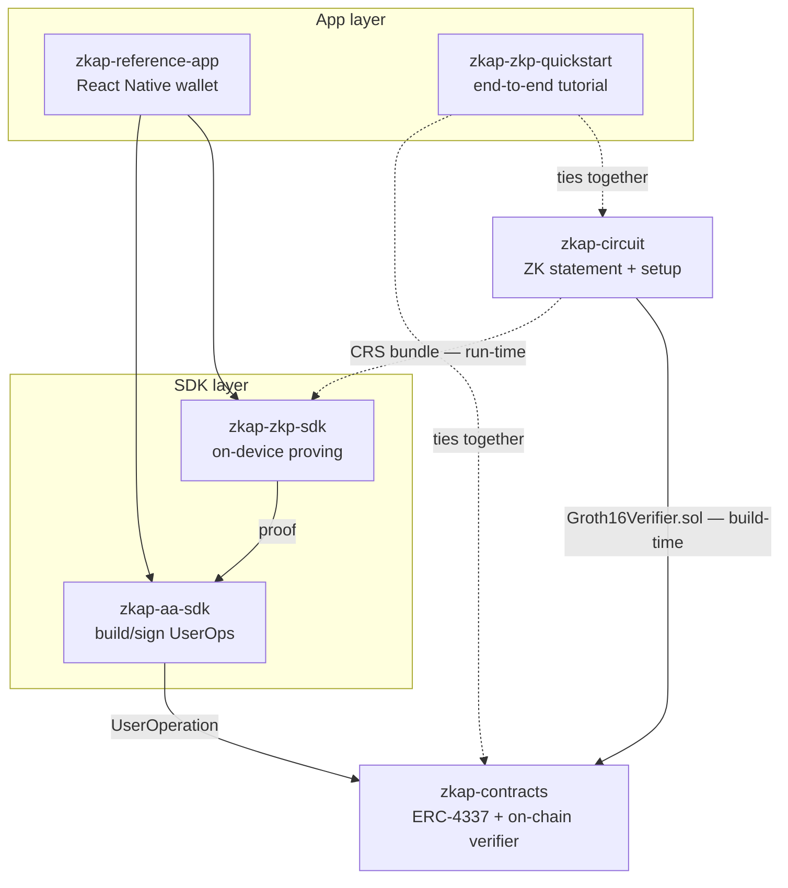

# ZKAP Repositories

*Read this in [한국어](../ko/REPOS.md).*

> The dependency graph and a deeper, repo-by-repo description of each layer of
> ZKAP. For the system view see [ARCHITECTURE.md](./ARCHITECTURE.md); for terms,
> [GLOSSARY.md](./GLOSSARY.md). This hub is the **map**; each repo links back here.

> ⚠️ **Status:** experimental / testnet. Not audited for production custody of
> real funds.

---

## How the repos fit

ZKAP is split into focused repositories so each layer can be reused on its own.
Read them as a stack — cryptography at the bottom, the user-facing wallet at the
top.

**Two couplings carry the protocol:**

1. **`zkap-circuit` → `zkap-contracts` (build-time).** The circuit generates the
   on-chain `Groth16Verifier.sol`. The verifying contract and the keys that
   produce proofs must come from the **same trusted setup** — mix builds and
   every proof fails.
2. **`zkap-circuit` → `zkap-zkp-sdk` (run-time).** The SDK loads the circuit's
   **CRS bundle** to generate proofs on the user's device.

A proof from `zkap-zkp-sdk` is wrapped by `zkap-aa-sdk` into a UserOperation and
verified by `zkap-contracts` (using `zkap-circuit`'s generated verifier). The
reference app and quickstart stitch the whole path together.

| Layer | Repo | Role | Stack |
|-------|------|------|-------|
| Crypto | [zkap-circuit](https://github.com/snp-labs/zkap-circuit) | zk-OAuth statement, trusted setup, proving/verifying, EVM-verifier codegen | Rust · arkworks · Groth16 · BN254 |
| SDK | [zkap-zkp-sdk](https://github.com/baerae-zkap/zkap-zkp-sdk) | On-device proving across runtimes | Rust core → Node / WASM / React Native |
| On-chain | [zkap-contracts](https://github.com/baerae-zkap/zkap-contracts) | ERC-4337 account, factory, paymaster, on-chain verifier | Solidity · Hardhat / Foundry |
| SDK | [zkap-aa-sdk](https://github.com/baerae-zkap/zkap-aa-sdk) | Account-abstraction SDK: build & sign UserOperations | TypeScript |
| App | [zkap-reference-app](https://github.com/baerae-zkap/zkap-reference-app) | Reference wallet demonstrating the full lifecycle | React Native (Expo) |
| App | [zkap-zkp-quickstart](https://github.com/baerae-zkap/zkap-zkp-quickstart) | End-to-end tutorial | TypeScript · docs |

---

## The repositories

### zkap-circuit — the cryptographic core

- **Org / URL:** `snp-labs` · https://github.com/snp-labs/zkap-circuit
- **Role.** The source of truth for *what ZKAP proves*: the Rust circuit, the
  trusted-setup output, the proving/verifying service, and the on-chain verifier
  codegen.
- **Key parts.** Rust workspace of crates — `service` (public API: setup/prove,
  `ArtifactSet`, hash/anchor helpers), `circuit` (the R1CS statement), `gadget`
  (Poseidon / SHA-256 / RSA / base64 / Merkle / anchor), `cli` (setup & ceremony
  binaries), `zkap-evm-verifier` (Solidity codegen), `witness-gen-wasm`.
- **What it produces.** A CRS bundle (`pk.bin`, `vk.bin`, `pvk.bin`,
  `Groth16Verifier.sol`, `config.json`, `manifest.json`, optional
  `witness_gen.wasm`). The manifest's hash/signature checks are the single trust
  gate.
- **Shapes.** Released as **1-of-1** (single issuer) and **3-of-3** (threshold).
- **Connects to.** Feeds `Groth16Verifier.sol` to `zkap-contracts` (build-time)
  and the CRS bundle to `zkap-zkp-sdk` (run-time).
- **License:** MIT OR Apache-2.0 (dual). **Status:** experimental.
- **Entry docs:** `README.md`, `docs/CIRCUIT_DESIGN.md`, `docs/API_REFERENCE.md`.

### zkap-zkp-sdk — on-device proving  *(key repo for the licensing discussion)*

- **Org / URL:** `baerae-zkap` · https://github.com/baerae-zkap/zkap-zkp-sdk
- **Role.** Turns the circuit into something an application can call. One Rust
  core is compiled to three runtimes so proofs are generated where the token
  already is — on the user's device — and never sent to a backend.
- **Reusability.** This is the layer a third-party wallet adopts to *generate*
  ZKAP proofs without touching Rust or the circuit internals. It is independent
  of any particular UI or chain.
- **Public surface (packages).**
  - `@baerae/zkap-zkp-node` — Node.js
  - `@baerae/zkap-zkp-wasm` — browser WebAssembly
  - `@baerae/zkap-zkp-react-native` — mobile
  - `@baerae/zkap-zkp` — a compatibility facade with a uniform Promise API and a
    `downloadRelease()` helper (install one runtime package beside it).
- **Public API.** Host-side helpers (`generateHash`, `generateAudHash`,
  `generateAnchor`, `loadCircuitConfig`) and `prove()`. `prove` runs on Node and
  React Native; it is not available in WASM (memory limits). Trusted setup is not
  part of the public SDK.
- **Depends on.** The circuit's CRS bundle at run time (staged via `manifestDir`).
- **License:** MIT OR Apache-2.0 (dual). **Status:** published to npm.
- **Entry docs:** `README.md`, `docs/API_REFERENCE.md`, `docs/REACT_NATIVE_GUIDE.md`.

### zkap-contracts — the on-chain layer

- **Org / URL:** `baerae-zkap` · https://github.com/baerae-zkap/zkap-contracts
- **Role.** The ERC-4337 smart account and everything around it that verifies
  proofs and enforces account policy on-chain.
- **Key contracts.** `ZkapAccount` (the dual-key wallet), `ZkapAccountFactory`
  (CREATE2 deterministic deployment), the account-key verifiers
  (`AccountKeyAddress` ECDSA, `AccountKeySecp256r1` / `AccountKeyWebAuthn`
  passkeys, `AccountKeyZkOAuthRS256Verifier` the ZK-OAuth master key),
  `PoseidonMerkleTreeDirectory` (trusted-issuer key tree), `ZkapPaymaster`
  (optional gas sponsorship), `ZkapTimelockController` (governance).
- **Connects to.** Consumes `Groth16Verifier.sol` generated by `zkap-circuit`;
  verifies the UserOperations submitted by `zkap-aa-sdk`.
- **Live on testnet.** Deployed on Base Sepolia (`84532`) and Arbitrum Sepolia
  (`421614`) at identical CREATE2 addresses (verified on-chain). Key contract
  addresses are listed in the [README](./README.md).
- **License:** MIT — *but* the generated `Groth16Verifier*.sol` files are
  GPL-3.0 and the BN128 libraries are LGPL-3.0+ (see the repo's `LICENSE`).
  **Status:** deployed on testnets.
- **Entry docs:** `README.md`, `docs/`.

### zkap-aa-sdk — account abstraction for apps  *(key repo for the licensing discussion)*

- **Org / URL:** `baerae-zkap` · https://github.com/baerae-zkap/zkap-aa-sdk
- **Role.** The TypeScript SDK that builds and signs ERC-4337 UserOperations for
  ZKAP wallets, so an app never has to hand-assemble account-abstraction plumbing.
- **Reusability.** This is the layer a third-party app adopts to *use* a ZKAP
  wallet (send transactions, recover, update keys) without learning the contract
  internals. Pairs with `zkap-zkp-sdk`, which supplies the proof.
- **Public surface.** `@baerae/zkap-aa` (npm). Exports include `WalletHelper`
  (full UserOp lifecycle), signers (`AddressKeySigner`, passkey, ZK-OIDC),
  `ChainRegistry`, bundler client, `deriveAddress` (counterfactual address), and
  the contract ABIs.
- **Depends on.** `ethers` (peer); a bundler; the deployed `zkap-contracts`. Takes
  the proof from `zkap-zkp-sdk` and encodes it as the ZK-OAuth signature.
- **License:** **ISC** (current). **Status:** published to npm.
- **Entry docs:** `README.md`, `examples/`.

### zkap-reference-app — the full wallet, demonstrated

- **Org / URL:** `baerae-zkap` · https://github.com/baerae-zkap/zkap-reference-app
- **Role.** A React Native (Expo) reference wallet that runs the entire lifecycle
  on a real testnet, with **all ZK proofs generated on-device** and **zero calls
  to any ZKAP backend**.
- **Scenarios.** Wallet creation, ETH transfer, recovery-account update, passkey
  re-registration, and phone-change recovery.
- **Connects to.** Uses `zkap-zkp-sdk` (React Native) for proving and
  `zkap-aa-sdk` for UserOps. Single chain: Base Sepolia. Downloads the CRS bundle
  on first run and verifies the witness generator against it before proving
  (fail-closed).
- **License:** MIT OR Apache-2.0 (dual). **Status:** testnet demo.
- **Entry docs:** `README.en.md` (English), `README.md` (Korean).

### zkap-zkp-quickstart — the end-to-end tutorial

- **Org / URL:** `baerae-zkap` · https://github.com/baerae-zkap/zkap-zkp-quickstart
- **Role.** A step-by-step guide that walks the whole protocol from scratch: build
  the circuit, deploy contracts, configure OIDC, create a wallet, send a
  transaction, and update a key with a ZK proof. How a new developer goes from
  zero to a working on-chain ZK-OAuth flow.
- **What's inside.** Numbered docs (`docs/00`–`09`), automation scripts, an OAuth
  callback server, runnable per-step code, and a longer `ZKAP-ECOSYSTEM-EN.md`
  deep-dive.
- **Connects to.** Ties `zkap-circuit`, `zkap-contracts`, `zkap-zkp-sdk`, and
  `zkap-aa-sdk` together as one path.
- **License:** MIT OR Apache-2.0 (dual). **Status:** tutorial.
- **Entry docs:** `docs/00-overview.md`, then the numbered steps.

> **Cross-repo reconciliation.** A couple of the downstream repos'
> READMEs carry older framing that these umbrella docs supersede:
> - **Verifier shapes.** The deployed testnet verifiers are **1-of-1** and
>   **3-of-3** (see the README address table). `zkap-contracts` also ships an
>   `N=6/K=3` verifier its README calls the "production default"; that shape is
>   **not** the currently released/deployed circuit shape.
> - **Providers / threshold.** The `zkap-aa-sdk` and `zkap-contracts` READMEs
>   still mention Kakao and a single-provider (`zkapK = 1`) signer path that
>   predate the current Google + k-of-n threshold reference configuration. Treat
>   these overview docs as authoritative on provider scope and threshold
>   semantics.

---

## Artifact flow between repos

Beyond code dependencies, two build artifacts move between repos:

- **`Groth16Verifier.sol`** — generated by `zkap-circuit`, copied into
  `zkap-contracts` at build time. Must match the trusted setup.
- **CRS bundle** (`pk.bin` / `vk.bin` / `pvk.bin` / `config.json` /
  `manifest.json` / `witness_gen.wasm`) — produced by `zkap-circuit`, downloaded
  and staged by `zkap-zkp-sdk` (and the reference app) at run time.
- **Contract ABIs** — published through `zkap-aa-sdk` so apps call the contracts
  without copying ABIs by hand.

---

## License & status tables

| Repo | License (current) | Target |
|------|-------------------|--------|
| zkap-circuit | MIT OR Apache-2.0 (dual) | already dual |
| zkap-zkp-sdk | MIT OR Apache-2.0 (dual) | already dual |
| zkap-contracts | MIT (generated verifier GPL-3.0; BN128 libs LGPL-3.0+) | dual — *pending* |
| zkap-aa-sdk | ISC | dual — *pending* |
| zkap-reference-app | MIT OR Apache-2.0 (dual) | already dual |
| zkap-zkp-quickstart | MIT OR Apache-2.0 (dual) | already dual |

> **Licensing is not yet finalized.** The protocol targets dual **MIT /
> Apache-2.0** as a public good (generated on-chain verifier files keep their
> upstream GPL/LGPL headers).

| Repo | Status |
|------|--------|
| zkap-circuit | Experimental; released in 1-of-1 and 3-of-3 shapes |
| zkap-zkp-sdk | Published to npm |
| zkap-contracts | Deployed on Base Sepolia + Arbitrum Sepolia |
| zkap-aa-sdk | Published to npm |
| zkap-reference-app | Testnet demo (full lifecycle, on-device) |
| zkap-zkp-quickstart | Tutorial |
