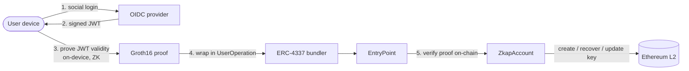
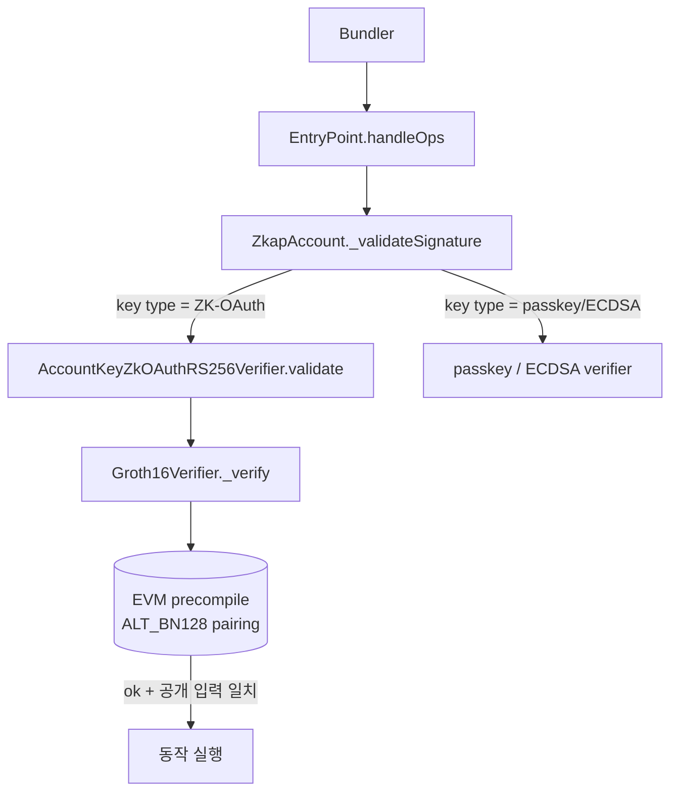

# ZKAP 아키텍처

*이 문서의 [English](../en/ARCHITECTURE.md) 버전.*

> ZKAP이 어떻게 동작하는가 — 개념 수준: 엔드투엔드 흐름, 계층 스택, 회로가 무엇을
> 증명하는가, 증명이 온체인에서 어떻게 검증되는가. 코드 수준 디테일은 각 레포에
> 있습니다([REPOS.md](./REPOS.md)). 용어는 [GLOSSARY.md](./GLOSSARY.md),
> 신뢰 경계 요약은 [TRUST-MODEL.md](./TRUST-MODEL.md).

> ⚠️ **상태:** 실험적 / 테스트넷. 실제 자금의 프로덕션 수탁을 위한 감사는 받지
> 않았습니다.

---

## 1. 다이어그램 한 장으로 보는 아이디어

ZKAP은 소셜 로그인 토큰이 유효함을 영지식으로 증명하고, 그 증명을 이더리움 스마트
계정의 최상위 권한으로 사용합니다.



토큰은 저장되거나 노출되지 않고 검증됩니다: JWT는 기기에 머물고, 증명이 온체인에
가며, 컨트랙트는 증명을 검사할 뿐 토큰은 보지 않습니다.

---

## 2. 계층 아키텍처

ZKAP은 네 계층입니다. 각각은 독립적으로 재사용할 수 있는 별도 레포입니다.

```
   ┌─────────────────────────────────────────────────────────────┐
   │  APP        zkap-reference-app   (React Native 지갑)          │
   │             zkap-zkp-quickstart  (엔드투엔드 튜토리얼)         │
   ├─────────────────────────────────────────────────────────────┤
   │  SDK        zkap-aa-sdk          zkap-zkp-sdk                 │
   │             (UserOp 구성/서명)   (온디바이스 증명)            │
   ├─────────────────────────────────────────────────────────────┤
   │  ON-CHAIN   zkap-contracts       (ERC-4337 + 온체인 verifier) │
   ├─────────────────────────────────────────────────────────────┤
   │  CRYPTO     zkap-circuit         (ZK 명제 + 셋업)             │
   └─────────────────────────────────────────────────────────────┘
```

**계층을 가로질러 프로토콜을 떠받치는 두 개의 결합:**

1. **빌드 타임: `zkap-circuit` → `zkap-contracts`.** 회로가 온체인
   `Groth16Verifier.sol`을 생성합니다. 검증 컨트랙트와 증명을 만드는 키는 **같은
   trusted setup**에서 나와야 하며, 빌드를 섞으면 모든 증명이 실패합니다.
2. **런타임: `zkap-circuit` → `zkap-zkp-sdk`.** SDK가 회로의 CRS 번들을 로드해 사용자
   기기에서 증명을 생성합니다.

나머지는 평범한 코드 의존입니다: 앱이 두 SDK를 호출하고, AA SDK는 컨트랙트를
대상으로 하며, quickstart가 전부를 엮습니다. 의존성 그래프는 [REPOS.md](./REPOS.md).

---

## 3. 증명 데이터 흐름

사용자가 마스터 키가 필요한 동작(생성·복구·키 업데이트)을 할 때 일어나는 일:

```mermaid
flowchart TD
    A[UserOperation 구성<br/>예: updateTxKey] --> B[userOpHash 계산]
    B --> C[random = 새 31바이트]
    C --> D[zkNonce = Poseidon&#40;userOpHash, random&#41;]
    D --> E[nonce = zkNonce 로 소셜 로그인]
    E --> F[제공자가 서명 JWT 반환<br/>nonce 클레임 = zkNonce]
    F --> G[계정의 anchor + issuer Merkle 데이터 읽기]
    G --> H[기기에서 prove&#40;&#41; → Groth16 증명 + 공개 입력]
    H --> I[증명을 UserOp의 ZK-OAuth 서명으로 인코딩]
    I --> J[번들러 → EntryPoint → ZkapAccount 온체인 검증]
```



핵심은 D–F 단계입니다: JWT의 `nonce`가 *바로 이* UserOperation에 묶이므로
(`zkNonce = Poseidon(userOpHash, random)`), 증명은 정확히 하나의 동작에만 유효하고
재사용될 수 없습니다. 일상 거래는 이 과정을 통째로 건너뜁니다 — TX 키(패스키)로
서명하며 증명이 필요 없습니다.

---

## 4. 회로가 증명하는 것

한 문장으로: *"나는 온체인 신뢰-issuer Merkle 트리에 있는 키로 (RS256 / RSA-2048)
서명된, 허용 audience에 대한 유효한 OIDC JWT를 보유하며, 이 증명은 특정 동작에 묶여
있다 — 토큰이나 어떤 클레임도 노출하지 않고."*

더 구체적으로, 명제는 다음을 검사합니다:

- **JWT 서명.** JWT는 **RS256**(표준 RSA-2048 + SHA-256)으로 서명되며, 회로가 그 서명을
  제공자의 RSA 공개키에 대해 검증.
- **Issuer 멤버십.** 그 RSA 키가 신뢰 issuer의 온체인 Poseidon Merkle 트리의 leaf임을
  — 공개된 root에 대한 Merkle path로 — 증명.
- **Audience 허용목록.** 토큰의 `aud`가 계정의 허용 집합(`hAudList`로 커밋)에 속함.
- **Threshold anchor 멤버십.** 신원이 등록된 k-of-n threshold anchor의 일부임(§6).
- **동작 바인딩.** 증명이 특정 `userOpHash`와 0이 아닌 random blind에 묶여 일회용임.

### 공개 입력 (개념 수준)

각 증명은 8-요소 공개 입력 벡터를 가집니다 — 온체인 verifier가 증명을 대조하는 값들.
개념적으로:

| 공개 입력 | 의미 |
|-----------|------|
| `hanchor` | 등록된 threshold anchor에 대한 커밋먼트 |
| `h_a` | 컨텍스트/anchor 해시 |
| `root` | 신뢰 issuer 키의 Merkle root |
| `h_sign_user_op` | 증명을 이 UserOperation에 묶음 |
| `jwt_exp` | JWT 만료(proof별) |
| `verification_rhs` | 임계 검사용 이 증명의 부분값(proof별) |
| `lhs` | 부분값들이 합산되어야 하는 임계 배치 총합 |
| `h_aud_list` | audience 커밋먼트; 계정의 `hAudList`와 일치해야 함 |

> 정확한 필드 순서·직렬화·명명은 [`zkap-circuit`](https://github.com/snp-labs/zkap-circuit)이
> 소유합니다 — 이 표는 wire 포맷이 아니라 개념입니다.

---

## 5. 듀얼 키 모델

모든 ZKAP 지갑은 두 역할을 두 종류의 키로 분리합니다 — 드물고 고가치인 권한과 빈번하고
저마찰인 권한이 결코 자격증명을 공유하지 않도록.

```
┌──────────────────── ZkapAccount (ERC-4337 스마트 계정) ───────────────────────┐
│                                                                               │
│   Master Key  (ZK-OAuth)              TX Key  (패스키 / ECDSA)                 │
│   ─────────────────────               ─────────────────────────               │
│   • 계정 소유권                        • 일상 거래                              │
│   • 복구                              • ETH / 토큰 전송                         │
│   • 키 업데이트                        • 컨트랙트 호출                           │
│                                                                               │
│   소셜 로그인 ZK 증명으로 승인          기기 보관 패스키 서명으로 승인            │
│   (드물고 고가치)                      (빈번하고 저마찰)                         │
└───────────────────────────────────────────────────────────────────────────────┘
```

- **마스터 키 (ZK-OAuth).** 사용하려면 소셜 로그인에 대한 새 ZK 증명이 필요. 회로가 보안
  모델에서 자리하는 지점.
- **TX 키.** 기기 보관 패스키가 일상 거래에 서명; 증명 불필요.

컨트랙트는 교체 가능한 키 verifier를 지원하므로, 한 계정이 목적별 가중치·임계와 함께 여러
키 타입을 등록할 수 있습니다:

| 키 타입 | Verifier 컨트랙트 | 용도 |
|---------|-------------------|------|
| ZK-OAuth (RS256) | `AccountKeyZkOAuthRS256Verifier` | 마스터 키 — 소유권 / 복구 |
| 패스키 (P-256) | `AccountKeySecp256r1` / `AccountKeyWebAuthn` | 일상 서명 |
| ECDSA | `AccountKeyAddress` | EOA식 서명 / 테스트 |

기기 분실은 복구 가능합니다: 마스터 키를 사용해(소셜 로그인 ZK 증명) 새 패스키를 등록.
시드 문구는 결코 없습니다.

---

## 6. Threshold anchor, issuer 디렉토리, audience

세 개의 온체인 커밋먼트가 계정의 신원 정책을 규정합니다.

- **Threshold anchor (k-of-n).** 복구는 *n*개의 독립 OIDC 신원 집합에 묶이며, 그 중
  임의의 *k*개 유효한 증명이 동작을 승인합니다 — Vandermonde / Shamir 방식 다항식.
  회로는 **모두 통과해야 하는 k개의 증명**을 내보내고, 온체인 verifier가 이들의 부분값이
  **하나의 배치로 합산되는지**(`Σ verification_rhs == lhs`)를 추가 검사합니다 — 이것이
  k개의 별도 증명을 하나의 임계 결정으로 묶습니다. 복구에 어떤 단일 issuer도 필수가
  아닙니다 — 단, 분산은 n개 신원이 진짜 독립 제공자일 때만 성립합니다(한 제공자의
  계정 3개는 임계 복구의 편의는 주지만 분산은 아닙니다).
- **Issuer Merkle 디렉토리.** 온체인 Poseidon Merkle 트리(`PoseidonMerkleTreeDirectory`)가
  신뢰 제공자의 RSA 공개키를 담습니다. 회로는 JWT 서명 키가 그 멤버임을 증명합니다.
  제공자가 키를 회전하면 트리를 업데이트합니다(timelock 거버넌스 하). height 매핑 주의:
  SDK/회로 Merkle path 길이는 `tree_height`(15), 온체인 트리 depth는 `tree_height + 1`(16).
- **Audience 커밋먼트(`hAudList`).** 허용 `aud`(OAuth client ID)가 계정에 Poseidon
  해시로 들어가며, 증명의 `h_aud_list`가 이와 같아야 합니다.

---

## 7. Trusted setup과 CRS 번들

Groth16은 회로마다 한 번의 trusted setup이 필요합니다. 그 출력이 **CRS 번들** —
SDK가 증명을 대조하는 디렉토리:

```
circuit.ar1cs  pk.bin  vk.bin  pvk.bin  Groth16Verifier.sol  config.json
manifest.json  [witness_gen.wasm]
```

- `pk.bin`은 증명 생성, `vk.bin` / `pvk.bin`은 검증, `Groth16Verifier.sol`은 온체인
  verifier, `config.json`은 회로 shape.
- **`manifest.json`이 단일 신뢰 게이트.** 파일별 해시와 선택적 서명을 담습니다. 로더가
  manifest를 *한 번* 검사하고, 이후 `prove()`는 번들을 신뢰하며 아무것도 재검증하지
  않습니다. 증명 hot path를 단순하게 유지하고 모든 무결성 검사를 한 곳(감사 가능)에 모읍니다.
- `witness_gen.wasm`은 독립적으로 배포되며, 증명 전 별도 `witness_gen.json`
  sidecar(회로의 `ar1cs_blake3`로 키잉)로 번들에 대해 검증됩니다(fail-closed).

soundness가 setup 비밀의 폐기에 달려 있으므로, 공공재 계획은 transcript를 공개하는
다자간 ceremony입니다.

---

## 8. 온체인 검증 경로

UserOperation이 도착하면 계정은 서명 검증을 올바른 키 verifier로 라우팅합니다.
ZK-OAuth 경로는 Groth16 pairing 검사를 수행합니다.



구체적 수치(개념 수준): Groth16 증명은 고정 ~256바이트(8 × uint256), 온체인 검증은
수십만 가스대로 BN254 pairing precompile이 대부분을 차지합니다. verifier는 공개
입력(audience, root, 동작 바인딩, 임계 배치)이 계정의 등록 정책과 일치하는지도
검사합니다.

핵심 컨트랙트는 한 번 배포되어 모든 지갑이 공유합니다(싱글톤 패턴). 각 지갑은 자신의 키
데이터를 저장합니다. 라이브러리 링킹이 ZK-OAuth verifier를 `Groth16Verifier`·
`PoseidonHashLib`에 연결합니다. 정확한 배선은
[`zkap-contracts`](https://github.com/baerae-zkap/zkap-contracts)에 있습니다.

---

## 9. 배포 & 주소

- **결정론적 주소.** `ZkapAccountFactory`가 CREATE2로 지갑을 배포하므로, 지갑은
  **counterfactual 주소**를 가집니다 — 배포 전에 알 수 있고 자금을 받을 수 있음. 첫
  UserOp이 `initCode`로 온체인 배포합니다.
- **체인 간 동일 주소.** 컨트랙트는 **Base Sepolia**(`84532`)·**Arbitrum
  Sepolia**(`421614`)에 **동일 CREATE2 주소**로 배포(온체인 검증됨). 주요 컨트랙트
  주소는 [README](./README.md) 참고.

---

## 10. 횡단 성질

- **리플레이 방지.** `zkNonce = Poseidon(userOpHash, random)`가 각 증명을 하나의
  UserOperation에 묶습니다. 증명은 다른 동작에 재사용될 수 없습니다.
- **프라이버시.** 증명은 기대 issuer/audience에 대한 유효 JWT가 존재한다는 사실만
  드러냅니다. 토큰·이메일·이름·기타 클레임은 결코 온체인에 올라가지 않습니다. *관찰
  가능한 것*: audience 커밋먼트, 증명 타이밍, 계정의 온체인 활동.
- **온디바이스 증명.** 증명은 토큰이 이미 있는 곳 — 사용자 기기 — 에서 생성되어, 로그인
  토큰이 백엔드로 전송되지 않습니다.

---

## 더 깊이 보려면

| 무엇 | 이동 |
|------|------|
| 회로·명제·trusted setup | [zkap-circuit](https://github.com/snp-labs/zkap-circuit) |
| 컨트랙트·온체인 검증 | [zkap-contracts](https://github.com/baerae-zkap/zkap-contracts) |
| 온디바이스 증명 / UserOp 구성 | [zkap-zkp-sdk](https://github.com/baerae-zkap/zkap-zkp-sdk) · [zkap-aa-sdk](https://github.com/baerae-zkap/zkap-aa-sdk) |
| 신뢰 경계 | [TRUST-MODEL.md](./TRUST-MODEL.md) |
| 용어 | [GLOSSARY.md](./GLOSSARY.md) |
