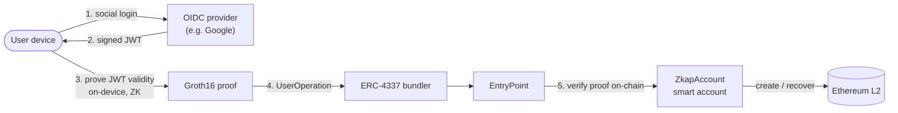

# ZKAP

*이 문서의 [English](../en/README.md) 버전.*

**소셜 로그인을 영지식으로 증명하세요. 이더리움에서 내 계정을 직접 소유하세요.**

ZKAP은 사용자가 자신의 소셜 로그인 토큰(Google 등 제공자가 발급한
OIDC ID 토큰 / JWT)이 유효함을 **토큰을 노출하지 않고** 영지식으로 증명할 수
있게 합니다. 이 증명은
[ERC-4337](https://eips.ethereum.org/EIPS/eip-4337) 스마트 계정의 루트 권한이
됩니다. 사용자는 익숙한 소셜 로그인으로 **시드 문구 없이** 지갑을 생성·복구하고,
일상적인 트랜잭션은 패스키로 서명합니다.

ZKAP은 **오픈소스 공공재(public-good) 인프라**입니다 — 회로, 컨트랙트, SDK를
공개하여 어떤 지갑이든 암호학을 다시 구현할 필요 없이 재사용할 수 있습니다.

> ⚠️ **상태:** 실험적 / 테스트넷. 실제 자금의 프로덕션 수탁(custody)을 위한
> 감사는 받지 않았습니다. [보안](#보안)을 참고하세요.

---

## 왜 중요한가

오늘날의 소셜 로그인 지갑은 편리하지만, 계정 생성과 복구가 보통 특정 제공자나
백엔드에 의존합니다 — 그래서 사용자의 접근 권한이 여전히 중앙화된 서버의 가용성과
정책에 좌우될 수 있습니다. ZKAP은 그 검증을 **온체인**으로 옮깁니다. 계정 생성과
복구는 백엔드가 아니라 스마트 계정 정책과 영지식 증명을 통해 검증 가능하게
수행됩니다.

- **시드 문구 없음.** 이미 쓰던 소셜 로그인으로 온보딩하고 복구합니다.
- **단일 신뢰 지점 없음.** 복구는 독립적인 여러 OIDC 제공자의 *임계값(threshold)* —
  k-of-n "임계 앵커(threshold anchor)" — 에 묶입니다. 어떤 단일 제공자도
  필수 불가결하지 않습니다.
- **토큰은 기기를 떠나지 않습니다.** 증명은 사용자 본인의 기기에서 수행되므로,
  로그인 토큰이 지갑 백엔드로 전송되지 않습니다.

Sui의 zkLogin과 Aptos의 Keyless는 이미 OIDC 로그인을 온체인에서 프로덕션으로
검증하고 있습니다. 이더리움에서는 비슷한 접근이 대체로 표준화 / 초기 단계에
머물러 있고, 채택된 프로덕션 지갑은 거의 없습니다. **ZKAP은 이를 실용적이고
재사용 가능한 인프라로서 이더리움에 가져오는 것을 목표로 합니다** — 그리고 이는
이더리움 재단의
[Trustless Manifesto](https://protocol.ethereum.foundation/)에 직접 대응합니다:
중요한 비밀 없음, 필수 불가결한 중개자 없음, 검증 불가능한 결과 없음.

---

## 여기서 시작하세요

| 당신은… | 이동 |
|----------|-------|
| 🔬 **프로젝트를 평가 중** (그랜트 심사자, 연구자) | [ARCHITECTURE.md](./ARCHITECTURE.md) → [TRUST-MODEL.md](./TRUST-MODEL.md) |
| 🛠️ **엔드투엔드로 실행해 보고 싶다** | [zkap-zkp-quickstart](https://github.com/baerae-zkap/zkap-zkp-quickstart) |
| 🔌 **앱에 통합하고 싶다** | [zkap-zkp-sdk](https://github.com/baerae-zkap/zkap-zkp-sdk) + [zkap-aa-sdk](https://github.com/baerae-zkap/zkap-aa-sdk) |
| 📱 **전체 지갑 플로우를 보고 싶다** | [zkap-reference-app](https://github.com/baerae-zkap/zkap-reference-app) |
| 🧠 **용어가 처음이다** (anchor, hAudList, UserOp…) | [GLOSSARY.md](./GLOSSARY.md) |

---

## 동작 방식 (한눈에)

1. 사용자가 OIDC 제공자로 인증하고 서명된 JWT를 받습니다.
2. 기기가 그 JWT가 기대하는 `aud`/`iss`에 대해 유효함을 증명하는
   **Groth16 증명**을 **토큰을 노출하지 않고** 생성합니다 —
   [`zkap-zkp-sdk`](https://github.com/baerae-zkap/zkap-zkp-sdk)를 통해
   [`zkap-circuit`](https://github.com/snp-labs/zkap-circuit)을 사용합니다.
3. 그 증명은 [`zkap-aa-sdk`](https://github.com/baerae-zkap/zkap-aa-sdk)에 의해
   [ERC-4337 `UserOperation`](https://eips.ethereum.org/EIPS/eip-4337)으로
   감싸집니다.
4. 온체인에서 [`zkap-contracts`](https://github.com/baerae-zkap/zkap-contracts)가
   증명을 검증하고 계정 생성, 복구, 또는 키 업데이트를 승인합니다.

다중 발급자 **임계 앵커(threshold anchor)**와 패스키/ZK 키 분리를 포함한 전체
세부 사항은 [ARCHITECTURE.md](./ARCHITECTURE.md)에 있습니다.

---

## 저장소 구성

ZKAP은 목적별 저장소로 나뉘어 있습니다. 이 저장소가 **지도(map)**이며, 아래의
각 저장소는 다시 여기로 링크합니다.

| 저장소 | 역할 | 스택 | 패키지 |
|------|------|-------|---------|
| [**zkap-circuit**](https://github.com/snp-labs/zkap-circuit) | zk-OAuth 증명 회로 (명제, 신뢰 설정, 증명/검증) | Rust · Groth16 · BN254 | — |
| [**zkap-zkp-sdk**](https://github.com/baerae-zkap/zkap-zkp-sdk) | 여러 런타임에서의 온디바이스 증명 SDK | Rust → Node / WASM / React Native | [`@baerae/zkap-zkp`](https://www.npmjs.com/package/@baerae/zkap-zkp) |
| [**zkap-contracts**](https://github.com/baerae-zkap/zkap-contracts) | ERC-4337 스마트 계정, 팩토리, 페이마스터, 온체인 검증기 | Solidity | — |
| [**zkap-aa-sdk**](https://github.com/baerae-zkap/zkap-aa-sdk) | 계정 추상화 SDK: UserOp 구성 및 서명 | TypeScript | [`@baerae/zkap-aa`](https://www.npmjs.com/package/@baerae/zkap-aa) |
| [**zkap-reference-app**](https://github.com/baerae-zkap/zkap-reference-app) | 전체 플로우를 시연하는 레퍼런스 지갑 | React Native (Expo) | — |
| [**zkap-zkp-quickstart**](https://github.com/baerae-zkap/zkap-zkp-quickstart) | 엔드투엔드 튜토리얼: 회로 → 컨트랙트 → 증명 → 온체인 | TypeScript / docs | — |

의존성 그래프와 각 계층에 대한 더 깊은 설명은 [REPOS.md](./REPOS.md)를
참고하세요.

---

## 테스트넷에서 라이브

ZKAP은 **Base Sepolia**(chainId `84532`)와 **Arbitrum Sepolia**(chainId
`421614`)에 동일한 CREATE2 주소로 배포·시연되어 있습니다(온체인 검증됨).

주요 컨트랙트 (Base Sepolia):

| 컨트랙트 | 주소 |
|----------|---------|
| EntryPoint (ERC-4337) | `0x4337084D9E255Ff0702461CF8895CE9E3b5Ff108` |
| ZkapAccountFactory | `0xC4963E40E40FD9AfD16BDF81f51E3D00d36aE8c9` |
| Groth16 Verifier (1-of-1) | `0x249E20ad72aEd5D663940d527155AeF1E8014FD1` |
| Groth16 Verifier (3-of-3) | `0x8213F5d4176185b6f44CCbE9C1e58B512Dc0a50E` |
| PoseidonMerkleTreeDirectory | `0x93167F5048100Cc592BCB1F686d35eDD24b63581` |

레퍼런스 앱은 전체 생애주기를 엔드투엔드로 시연합니다: 소셜 로그인 지갑 생성 →
일상 트랜잭션 → 기기 키를 분실한 후 독립적인 소셜 로그인을 통한 계정 복구.

---

## 신뢰 모델 (요약)

ZKAP은 여전히 다음에 의존합니다: **OIDC 제공자(예: Google)의 가용성과 키
정확성**, 그리고 **ERC-4337 인프라(번들러)**. 반면 수탁이나 복구를 위해 ZKAP
백엔드에 의존하지 *않습니다* — 서명 키는 사용자의 기기(패스키)에 존재하고,
복구는 독립적인 제공자들의 k-of-n 임계값에 묶여 **어떤 단일 제공자도 신뢰 지점이
되지 않으며**, 온체인에서는 신원 검증만 영지식으로 수행됩니다.
[TRUST-MODEL.md](./TRUST-MODEL.md) 참고.

---

## 상태

ZKAP은 실험적이며 오늘날 공개 테스트넷에서 동작합니다. 프로토콜 — 회로,
컨트랙트, SDK — 은 공공재로서 공개되어 누구나 자유롭게 그 위에 구축할 수
있습니다.

## 라이선스

MIT와 Apache-2.0로 이중 라이선스되며,
선택은 사용자에게 있습니다. 각 저장소도 동일한 이중 라이선스를 따릅니다. 다만
`zkap-contracts` 내에서 생성된 온체인 검증기 파일은 상위 출처의 GPL/LGPL 헤더를
유지합니다(해당 저장소의 `LICENSE` 참고).

## 보안

취약점은 **jaewoong@baerae.com**으로 비공개로 제보해 주세요 — 보안 제보를 위해
공개 이슈를 열지 마세요.

## 감사의 말

ZKAP의 영지식 회로는 **한양대학교 SNP Lab**과 공동 개발되었습니다. zk-SNARK 증명
시스템에 대한 이들의 연구(IEEE TDSC, Financial Cryptography, ACM AsiaCCS, ACM CCS
게재)가 zk-OAuth 회로를 동료 심사를 거친 증명 시스템 연구에 기반하게 합니다.
