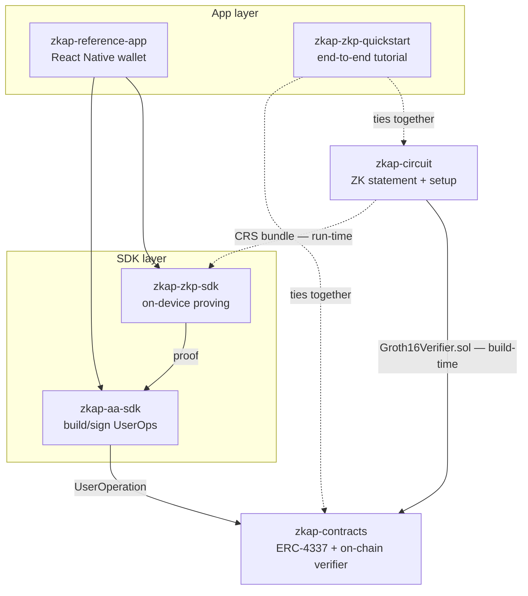

# ZKAP 저장소

*이 문서의 [English](../en/REPOS.md) 버전.*

> ZKAP 각 계층의 의존성 그래프와 저장소별 심화 설명. 시스템 관점은
> [ARCHITECTURE.md](./ARCHITECTURE.md), 용어는 [GLOSSARY.md](./GLOSSARY.md)
> 참고. 이 허브가 **지도(map)**이며, 각 저장소는 다시 여기로 링크합니다.

> ⚠️ **상태:** 실험적 / 테스트넷. 실제 자금의 프로덕션 수탁을 위한 감사는 받지
> 않았습니다.

---

## 저장소가 어떻게 맞물리나

ZKAP은 각 계층을 독립적으로 재사용할 수 있도록 목적별 저장소로 나뉩니다. 스택으로
읽으세요 — 맨 아래가 암호학, 맨 위가 사용자 대면 지갑입니다.

**프로토콜을 떠받치는 두 개의 결합:**

1. **`zkap-circuit` → `zkap-contracts` (빌드 타임).** 회로가 온체인
   `Groth16Verifier.sol`을 생성합니다. 검증 컨트랙트와 증명을 만드는 키는 **같은
   trusted setup**에서 나와야 합니다 — 빌드를 섞으면 모든 증명이 실패합니다.
2. **`zkap-circuit` → `zkap-zkp-sdk` (런타임).** SDK가 회로의 **CRS 번들**을 로드해
   사용자 기기에서 증명을 생성합니다.

`zkap-zkp-sdk`의 증명을 `zkap-aa-sdk`가 UserOperation으로 감싸고,
`zkap-contracts`가 (`zkap-circuit`이 생성한 verifier로) 검증합니다. 레퍼런스 앱과
quickstart가 이 전체 경로를 엮어 줍니다.

| 계층 | 저장소 | 역할 | 스택 |
|------|--------|------|------|
| Crypto | [zkap-circuit](https://github.com/snp-labs/zkap-circuit) | zk-OAuth 명제, trusted setup, 증명/검증, EVM verifier 코드 생성 | Rust · arkworks · Groth16 · BN254 |
| SDK | [zkap-zkp-sdk](https://github.com/baerae-zkap/zkap-zkp-sdk) | 여러 런타임에서의 온디바이스 증명 | Rust 코어 → Node / WASM / React Native |
| On-chain | [zkap-contracts](https://github.com/baerae-zkap/zkap-contracts) | ERC-4337 계정, 팩토리, 페이마스터, 온체인 verifier | Solidity · Hardhat / Foundry |
| SDK | [zkap-aa-sdk](https://github.com/baerae-zkap/zkap-aa-sdk) | 계정 추상화 SDK: UserOperation 구성·서명 | TypeScript |
| App | [zkap-reference-app](https://github.com/baerae-zkap/zkap-reference-app) | 전체 생애주기를 시연하는 레퍼런스 지갑 | React Native (Expo) |
| App | [zkap-zkp-quickstart](https://github.com/baerae-zkap/zkap-zkp-quickstart) | 엔드투엔드 튜토리얼 | TypeScript · docs |

---

## 저장소들

### zkap-circuit — 암호학 코어

- **Org / URL:** `snp-labs` · https://github.com/snp-labs/zkap-circuit
- **역할.** *ZKAP이 무엇을 증명하는가*의 정본: Rust 회로, trusted-setup 출력,
  증명/검증 서비스, 온체인 verifier 코드 생성.
- **핵심 구성.** Rust 워크스페이스 crate 모음 — `service`(공개 API: setup/prove,
  `ArtifactSet`, 해시/anchor 헬퍼), `circuit`(R1CS 명제), `gadget`(Poseidon /
  SHA-256 / RSA / base64 / Merkle / anchor), `cli`(setup·ceremony 바이너리),
  `zkap-evm-verifier`(Solidity 코드 생성), `witness-gen-wasm`.
- **생성물.** CRS 번들(`pk.bin`, `vk.bin`, `pvk.bin`, `Groth16Verifier.sol`,
  `config.json`, `manifest.json`, 선택 `witness_gen.wasm`). manifest의 해시/서명
  검사가 단일 신뢰 게이트.
- **Shape.** **1-of-1**(단일 발급자)·**3-of-3**(임계값)로 릴리스.
- **연결.** `Groth16Verifier.sol`을 `zkap-contracts`에(빌드타임), CRS 번들을
  `zkap-zkp-sdk`에(런타임) 공급.
- **라이선스:** MIT OR Apache-2.0 (dual). **상태:** 실험적.
- **진입 문서:** `README.md`, `docs/CIRCUIT_DESIGN.md`, `docs/API_REFERENCE.md`.

### zkap-zkp-sdk — 온디바이스 증명  *(라이선스 논의의 핵심 레포)*

- **Org / URL:** `baerae-zkap` · https://github.com/baerae-zkap/zkap-zkp-sdk
- **역할.** 회로를 애플리케이션이 호출할 수 있는 형태로 바꿉니다. 하나의 Rust 코어를
  세 런타임으로 컴파일해, 토큰이 이미 있는 곳 — 사용자 기기 — 에서 증명을 생성하며
  백엔드로 보내지 않습니다.
- **재사용성.** 서드파티 지갑이 Rust나 회로 내부를 건드리지 않고 ZKAP 증명을 *생성*할
  때 채택하는 계층. 특정 UI·체인에 독립적입니다.
- **공개 표면(패키지).**
  - `@baerae/zkap-zkp-node` — Node.js
  - `@baerae/zkap-zkp-wasm` — 브라우저 WebAssembly
  - `@baerae/zkap-zkp-react-native` — 모바일
  - `@baerae/zkap-zkp` — 균일한 Promise API와 `downloadRelease()` 헬퍼를 제공하는
    호환 facade(옆에 런타임 패키지 하나를 함께 설치).
- **공개 API.** 호스트 측 헬퍼(`generateHash`, `generateAudHash`,
  `generateAnchor`, `loadCircuitConfig`)와 `prove()`. `prove`는 Node·React
  Native에서 동작하며 WASM에서는 불가(메모리 제약). trusted setup은 공개 SDK에
  포함되지 않습니다.
- **의존.** 런타임에 회로의 CRS 번들(`manifestDir`로 staged).
- **라이선스:** MIT OR Apache-2.0 (dual). **상태:** npm 게시됨.
- **진입 문서:** `README.md`, `docs/API_REFERENCE.md`, `docs/REACT_NATIVE_GUIDE.md`.

### zkap-contracts — 온체인 계층

- **Org / URL:** `baerae-zkap` · https://github.com/baerae-zkap/zkap-contracts
- **역할.** ERC-4337 스마트 계정과, 증명을 검증하고 계정 정책을 온체인에서 집행하는 그
  주변 전부.
- **핵심 컨트랙트.** `ZkapAccount`(듀얼 키 지갑), `ZkapAccountFactory`(CREATE2
  결정론적 배포), 계정 키 verifier(`AccountKeyAddress` ECDSA, `AccountKeySecp256r1`
  / `AccountKeyWebAuthn` 패스키, `AccountKeyZkOAuthRS256Verifier` ZK-OAuth 마스터
  키), `PoseidonMerkleTreeDirectory`(신뢰 issuer 키 트리), `ZkapPaymaster`(선택적
  가스 후원), `ZkapTimelockController`(거버넌스).
- **연결.** `zkap-circuit`이 생성한 `Groth16Verifier.sol`을 소비하고,
  `zkap-aa-sdk`가 제출한 UserOperation을 검증.
- **테스트넷 라이브.** Base Sepolia(`84532`)·Arbitrum Sepolia(`421614`)에 동일
  CREATE2 주소로 배포(온체인 검증됨). 주요 컨트랙트 주소는 [README](./README.md) 참고.
- **라이선스:** MIT — 단, 생성된 `Groth16Verifier*.sol`은 GPL-3.0, BN128 라이브러리는
  LGPL-3.0+ (레포 `LICENSE` 참고). **상태:** 테스트넷 배포됨.
- **진입 문서:** `README.md`, `docs/`.

### zkap-aa-sdk — 앱을 위한 계정 추상화  *(라이선스 논의의 핵심 레포)*

- **Org / URL:** `baerae-zkap` · https://github.com/baerae-zkap/zkap-aa-sdk
- **역할.** ZKAP 지갑을 위한 ERC-4337 UserOperation을 구성·서명하는 TypeScript SDK.
  앱이 계정 추상화 배관을 직접 조립할 필요가 없게 합니다.
- **재사용성.** 서드파티 앱이 컨트랙트 내부를 몰라도 ZKAP 지갑을 *사용*(거래·복구·키
  업데이트)할 때 채택하는 계층. 증명을 공급하는 `zkap-zkp-sdk`와 짝을 이룹니다.
- **공개 표면.** `@baerae/zkap-aa`(npm). export에는 `WalletHelper`(UserOp 전체
  생애주기), signer(`AddressKeySigner`, 패스키, ZK-OIDC), `ChainRegistry`, 번들러
  클라이언트, `deriveAddress`(counterfactual 주소), 컨트랙트 ABI 포함.
- **의존.** `ethers`(peer); 번들러; 배포된 `zkap-contracts`. `zkap-zkp-sdk`의 증명을
  받아 ZK-OAuth 서명으로 인코딩.
- **라이선스:** **ISC**(현재). **상태:** npm 게시됨.
- **진입 문서:** `README.md`, `examples/`.

### zkap-reference-app — 시연된 전체 지갑

- **Org / URL:** `baerae-zkap` · https://github.com/baerae-zkap/zkap-reference-app
- **역할.** 전체 생애주기를 실제 테스트넷에서 돌려 보이는 React Native(Expo) 레퍼런스
  지갑. **모든 ZK 증명은 온디바이스 생성**, **ZKAP 백엔드 호출은 0**.
- **시나리오.** 지갑 생성, ETH 전송, 복구 계정 업데이트, 패스키 재등록, 휴대폰 변경
  복구.
- **연결.** 증명에 `zkap-zkp-sdk`(React Native), UserOp에 `zkap-aa-sdk` 사용. 단일
  체인: Base Sepolia. 첫 실행 시 CRS 번들을 내려받고, 증명 전에 witness generator를
  번들에 대해 검증(fail-closed).
- **라이선스:** MIT OR Apache-2.0 (dual). **상태:** 테스트넷 데모.
- **진입 문서:** `README.en.md`(영어), `README.md`(한국어).

### zkap-zkp-quickstart — 엔드투엔드 튜토리얼

- **Org / URL:** `baerae-zkap` · https://github.com/baerae-zkap/zkap-zkp-quickstart
- **역할.** 프로토콜 전체를 처음부터 따라가는 단계별 가이드: 회로 빌드, 컨트랙트 배포,
  OIDC 설정, 지갑 생성, 거래 전송, ZK 증명으로 키 업데이트. 신규 개발자가 0에서
  동작하는 온체인 ZK-OAuth 흐름까지 가는 길.
- **내용물.** 번호 매긴 문서(`docs/00`–`09`), 자동화 스크립트, OAuth 콜백 서버,
  단계별 실행 코드, 더 긴 `ZKAP-ECOSYSTEM-EN.md` 심화 문서.
- **연결.** `zkap-circuit`·`zkap-contracts`·`zkap-zkp-sdk`·`zkap-aa-sdk`를 하나의
  경로로 엮음.
- **라이선스:** MIT OR Apache-2.0 (dual). **상태:** 튜토리얼.
- **진입 문서:** `docs/00-overview.md`, 이후 번호 순서.

> **저장소 간 정합성.** 일부 하위 레포 README는 이 허브 문서가 대체하는
> 옛 표현을 담고 있습니다:
> - **Verifier shape.** 배포된 테스트넷 verifier는 **1-of-1**·**3-of-3**(README 주소표
>   참고). `zkap-contracts`에는 README가 "production default"라 부르는 `N=6/K=3`
>   verifier도 있으나, 이는 현재 릴리스·배포된 회로 shape가 **아닙니다**.
> - **제공자 / 임계.** `zkap-aa-sdk`·`zkap-contracts` README는 여전히 Kakao와
>   단일 제공자(`zkapK = 1`) signer 경로를 언급하는데, 이는 현재 Google + k-of-n 임계
>   레퍼런스 구성 이전 표현입니다. 제공자 범위·임계 의미는 이 개요 문서를 정본으로 봅니다.

---

## 저장소 간 아티팩트 흐름

코드 의존성 외에, 두 개의 빌드 아티팩트가 저장소 사이를 이동합니다:

- **`Groth16Verifier.sol`** — `zkap-circuit`이 생성, 빌드 타임에 `zkap-contracts`로
  복사. trusted setup과 일치해야 함.
- **CRS 번들**(`pk.bin` / `vk.bin` / `pvk.bin` / `config.json` / `manifest.json` /
  `witness_gen.wasm`) — `zkap-circuit`이 생성, 런타임에 `zkap-zkp-sdk`(및 레퍼런스
  앱)가 내려받아 staging.
- **컨트랙트 ABI** — `zkap-aa-sdk`를 통해 제공되어, 앱이 ABI를 손으로 복사하지 않고
  컨트랙트를 호출.

---

## 라이선스 & 상태 표

| 저장소 | 라이선스(현재) | 목표 |
|--------|----------------|------|
| zkap-circuit | MIT OR Apache-2.0 (dual) | 이미 dual |
| zkap-zkp-sdk | MIT OR Apache-2.0 (dual) | 이미 dual |
| zkap-contracts | MIT (생성 verifier GPL-3.0; BN128 libs LGPL-3.0+) | dual — *미정* |
| zkap-aa-sdk | ISC | dual — *미정* |
| zkap-reference-app | MIT OR Apache-2.0 (dual) | 이미 dual |
| zkap-zkp-quickstart | MIT OR Apache-2.0 (dual) | 이미 dual |

> **라이선스는 아직 확정되지 않았습니다.** 프로토콜은 공공재로서 dual **MIT /
> Apache-2.0**을 지향합니다(생성된 온체인 verifier 파일은 상위 출처 GPL/LGPL 헤더
> 유지).

| 저장소 | 상태 |
|--------|------|
| zkap-circuit | 실험적; 1-of-1·3-of-3 shape로 릴리스 |
| zkap-zkp-sdk | npm 게시됨 |
| zkap-contracts | Base Sepolia + Arbitrum Sepolia 배포됨 |
| zkap-aa-sdk | npm 게시됨 |
| zkap-reference-app | 테스트넷 데모(전체 생애주기, 온디바이스) |
| zkap-zkp-quickstart | 튜토리얼 |
